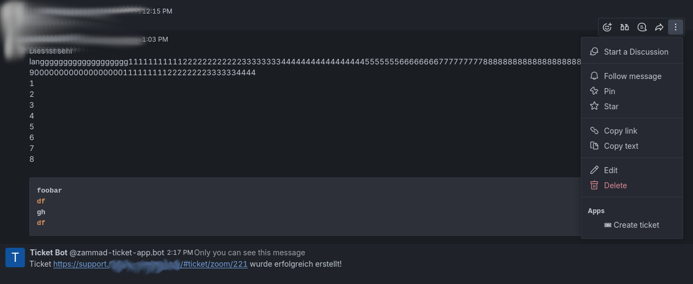
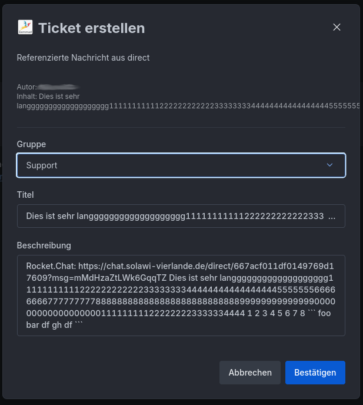

# Rocket.Chat Zammad Ticket App

A Rocket.Chat App that allows users to create Zammad tickets directly from messages in Rocket.Chat. A webhook is send to the configured webhook URL with the ticket data. We use [n8n](https://n8n.io) as a middleware currently.




## Features

- Create tickets from any message in Rocket.Chat
- Configurable ticket groups
- Multilingual support (English and German)
- Automatic link back to the original Rocket.Chat message
- Customizable bot username and display name

## How it Works

1. Click the menu icon (three dots) next to any message
2. Select "Create ticket" from the menu
3. Fill in the ticket details:
   - Group: Select from predefined ticket groups
   - Title: Automatically populated with the first line of the message (max 80 characters)
   - Description: Pre-filled with the message content and a link back to the original message

## Installation

You have two options to install the app:

### Option 1: Download Pre-built Package

1. Download the latest release from [GitHub Releases](https://github.com/yeoldegrove/Rocket.Chat-Zammad-Ticket-App/releases)
2. In Rocket.Chat, go to Administration > Apps > Upload App
3. Select the downloaded ZIP file
4. Follow the installation prompts
5. Configure the app settings (see Configuration section below)

### Option 2: Build it Yourself

If you want to build the app from source:

1. Clone this repository
2. Install dependencies:
   ```bash
   npm install
   ```
3. Build the app:
   ```bash
   npx @rocket.chat/apps-cli package
   ```
   This will create a file `zammad-ticket-app_*.zip` in the `dist` folder.

4. Upload to Rocket.Chat:
   - Go to Administration > Apps > Upload App
   - Select the generated ZIP file
   - Follow the installation prompts
   - Configure the app settings as described below

## Configuration

### Required Settings

| Setting | Description |
|---------|-------------|
| Webhook URL | The URL where the ticket data will be sent |
| Bot Username | Username of the bot that will create tickets |
| Bot Name | Display name of the bot |
| App Language | Language for the app interface (en/de) |
| Ticket Groups | Comma-separated list of available ticket groups |

## Webhook Payload

When a ticket is created, the following data is sent to the webhook URL:

```json
{
    "formData": {
        "title": "Ticket title",
        "message": "Ticket description with link to original message",
        "group": "Selected group"
    },
    "user": {
        "id": "user_id",
        "username": "username",
        "email": "user@example.com",
        "name": "User Name"
    },
    "refMsgId": "ID of the referenced message",
    "room": {
        "id": "room_id",
        "name": "room_name",
        "type": "room_type"
    }
}
```

An [n8n](https://n8n.io) workflow can be used to create the ticket in Zammad.

```
{
  "name": "RocketChat -> Ticket eröffnen -> Zammad",
  "nodes": [
    {
      "parameters": {
        "authentication": "basicAuth",
        "resource": "ticket",
        "title": "={{ $json.body.formData.title }}",
        "group": "={{ $json.body.formData.group }}",
        "customer": "={{ $json.body.user.email }}",
        "article": {
          "articleDetails": {
            "subject": "={{ $json.body.formData.subject }}",
            "body": "={{ $json.body.formData.message }}",
            "visibility": "external",
            "sender": "Customer"
          }
        },
        "additionalFields": {}
      },
      "id": "d73753fb-61d1-403e-b94f-ff14bfc2c5cf",
      "name": "Zammad",
      "type": "n8n-nodes-base.zammad",
      "typeVersion": 1,
      "position": [
        940,
        540
      ],
      "credentials": {
        "zammadBasicAuthApi": {
          "id": "vgJ7mbjDMegyqu5t",
          "name": "rocketchat@example.com"
        }
      }
    },
    {
      "parameters": {
        "respondWith": "json",
        "responseBody": "={\n  \"ticket\": {\n    \"id\": \"{{ $json.id }}\",\n    \"url\": \"https://support.example.com/#ticket/zoom/{{ $json.id }}\"\n  }\n}",
        "options": {}
      },
      "id": "0905e6e4-ba59-404c-bc24-738b46de2d56",
      "name": "Respond to Webhook",
      "type": "n8n-nodes-base.respondToWebhook",
      "typeVersion": 1.1,
      "position": [
        1160,
        540
      ]
    },
    {
      "parameters": {
        "httpMethod": "POST",
        "path": "7ec3d8fc-ba0a-421b-b1a8-6c78fbc25ef7",
        "responseMode": "responseNode",
        "options": {}
      },
      "id": "b825f69a-04c9-4ea0-9112-3e9947d27d92",
      "name": "Webhook",
      "type": "n8n-nodes-base.webhook",
      "typeVersion": 2,
      "position": [
        720,
        540
      ],
      "webhookId": "7ec3d8fc-ba0a-421b-b1a8-6c78fbc25ef7"
    }
  ],
  "pinData": {},
  "connections": {
    "Zammad": {
      "main": [
        [
          {
            "node": "Respond to Webhook",
            "type": "main",
            "index": 0
          }
        ]
      ]
    },
    "Webhook": {
      "main": [
        [
          {
            "node": "Zammad",
            "type": "main",
            "index": 0
          }
        ]
      ]
    }
  },
  "active": true,
  "settings": {
    "executionOrder": "v1"
  },
  "versionId": "67c5e841-1598-45e4-b47e-09bf05e4ee6e",
  "meta": {
    "templateCredsSetupCompleted": true,
    "instanceId": "d2bfc2b0d7f0c03821f99a51a38ad144554d708a3f61b0b04045bfd668d058a4"
  },
  "id": "z6UJCsadd4SZZI7v",
  "tags": [
    {
      "createdAt": "2024-08-27T11:20:52.870Z",
      "updatedAt": "2024-08-27T11:20:52.870Z",
      "id": "BxARLVswMCfLdsmH",
      "name": "Rocketchat"
    },
    {
      "createdAt": "2024-11-24T11:35:30.408Z",
      "updatedAt": "2024-11-24T11:35:30.408Z",
      "id": "ZM2OhUcpesVZjt3e",
      "name": "Zammad
"
    }
  ]
}
```

## Kodus

- This was initially based on @juzer's [Rocket.Chat-reminder](https://github.com/juzser/Rocket.Chat-reminder/) app.

## License

[MIT License](LICENSE)
